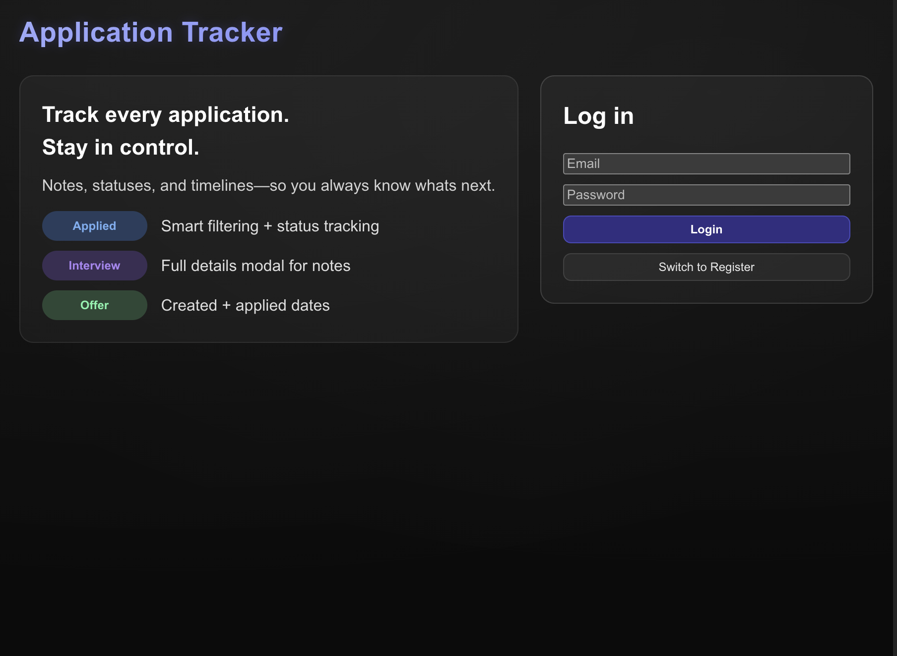
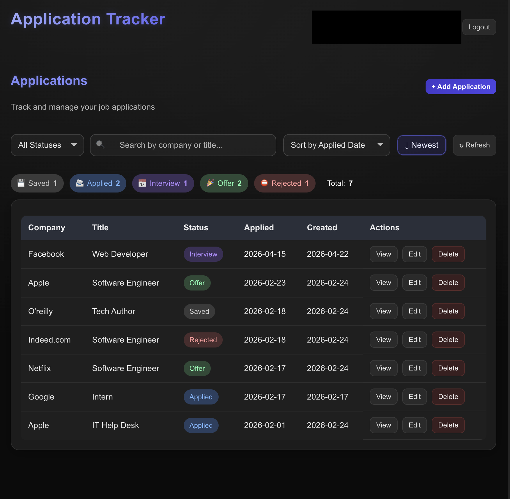
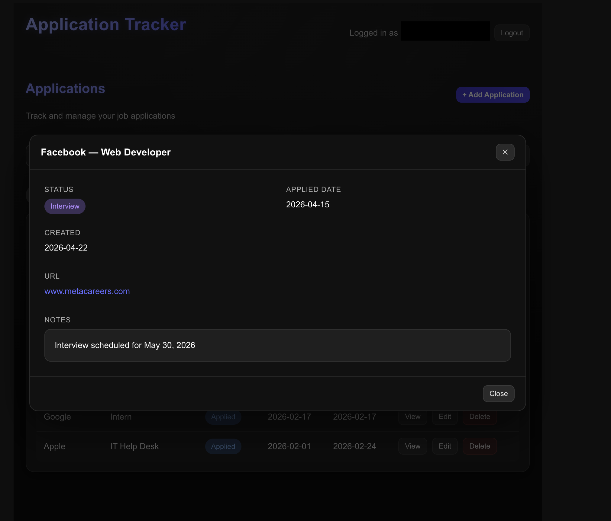
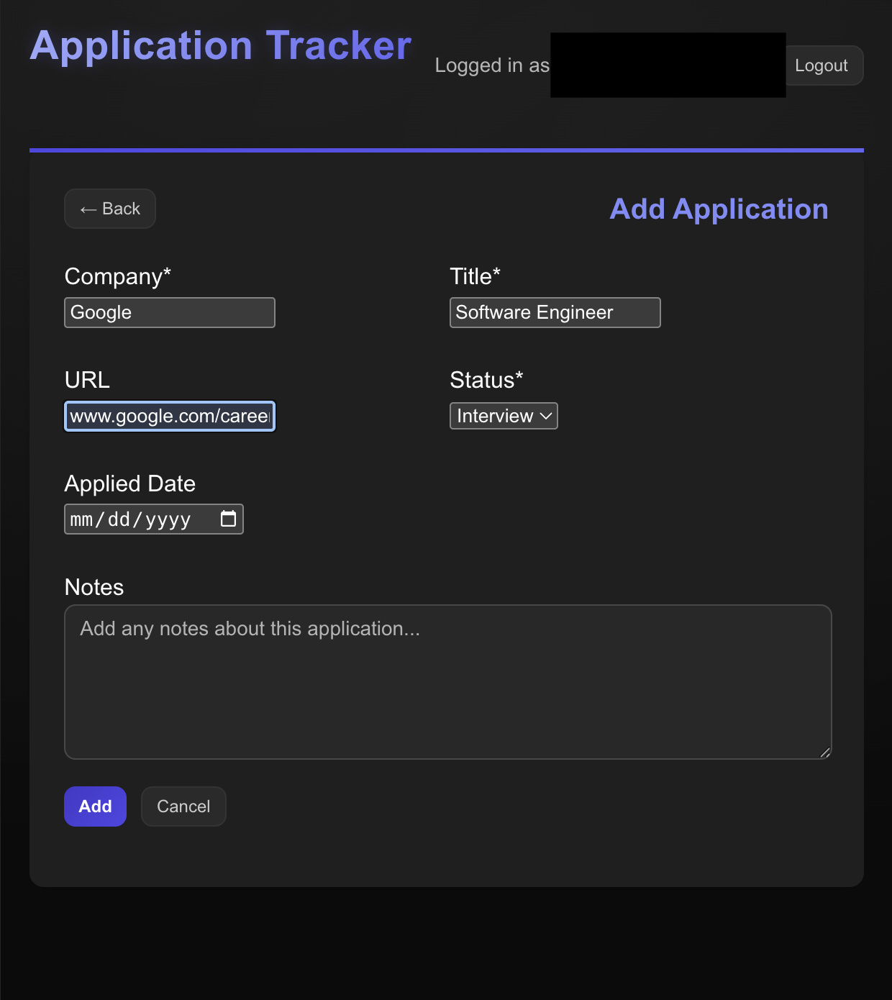

# Job Application Tracker

A full-stack web app for tracking job applications.

**Live demo:** https://job-application-tracker-production-0087.up.railway.app

## Screenshots

*Authentication screen — users can register or log in.*

*Dashboard with filtering, search, status summary, and sortable application list.*

*Details modal showing a single application's full information.*

*Form for adding a new job application.*

---

**Stack:** React, Vite, Node.js, Express, MySQL, bcrypt auth with session cookies

## Try it out

Want to take it for a spin without signing up? Log in with the demo account:

- **Email:** `demo@demo.com`
- **Password:** `demouser2026`

Feel free to add, edit, and delete job applications — it's a shared demo account, so you may see other visitors' entries too.
